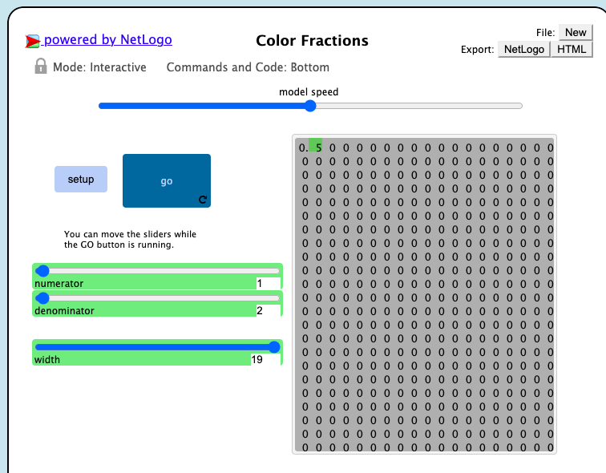

## Імітаційне моделювання комп'ютерних систем
## СПм-21-2, **Сергєєв Данило Андрійович**
### Лабораторная работа №**1**. Описание имитационных моделей

 

### Выбранная модель в среде NetLogo:
[Color Fractions](http://www.netlogoweb.org/launch#http://www.netlogoweb.org/assets/modelslib/Sample%20Models/Mathematics/Color%20Fractions.nlogo)

 

### Вербальное описание модели:
Color Fractions отображает десятичную форму дроби в виде набора цветов. Это позволяет вам исследовать, как полученные закономерности соотносятся с исходной дробью.

### Управляющие параметры:
- **numerator** определеяет какое будет делимое
- **denominator**  определеяет каким будет делитель
- **width** позволяет менять ширину отображаемой области цифр
- 
### Внутренние параметры:
- **numeratort** проход каждого расчета слева-направо и сверху-вниз
- **stratified-list**. подсчитывает количество вариаций (из 16)
- **stratified-indices**.  список индексирует позиции 16 перестановок.
- **target-color other-color** цвета квадратов до и после начал симуляции

### Критерии эффективности системы:
- Практический расчет должно соответствовать отоброжаемому, корректная работа модеил 

### Недостатки модели:
Невозможно установить делимое и делитель более 100 

 

## Вычислительные эксперименты

### 1. Проведем эксперимент с одной и той же дробью, затем увеличим и числитель, и знаменатель в одинаокове количество раз:

### 2. Влияние увелечение вероятности выпадения зеленого квадрата на распределение

Увеличим вероятность до 80%. Проведем 5 эксперементов по 1000 шагов каждый.

<table>
<thead>
<tr><th>Номер эксперимента</th><th>Количество зеленх квадратов 0-1-2-3-4</th></tr>
</thead>
<tbody>
<tr><td>1</td><td>2-26-139-423-410</td></tr>
<tr><td>2</td><td>1-30-162-393-414</td></tr>
<tr><td>3</td><td>1-25-151-417-406</td></tr>
<tr><td>4</td><td>0-27-153-420-400</td></tr>
<tr><td>5</td><td>1-27-165-397-410</td></tr>
</tbody>
</table>

Посчитаем среднее арифмитическое каждого случая. 

<table>
<thead>
<tr><th>Количество зеленых квадратов </th><th>Среднее арифметическое</th></tr>
</thead>
<tbody>
<tr><td>0</td><td>1</td></tr>
<tr><td>1</td><td>27</td></tr>
<tr><td>2</td><td>154</td></tr>
<tr><td>3</td><td>410</td></tr>
<tr><td>4</td><td>408</td></tr>
</tbody>
</table>

Результат: Когда вероятность получения зеленого квадрата установлена на 80%, возникающее эмпирическое распределение будет смещаться
0:1:6:16:16(1:26:154:410:408)

### 3. Влияние уменьшение вероятности выпадения зеленого квадрата на распределение

Уменьшим вероятность до 20%. Проведем 5 эксперементов по 1000 шагов каждый.

<table>
<thead>
<tr><th>Номер эксперимента</th><th>Количество зеленх квадратов 0-1-2-3-4</th></tr>
</thead>
<tbody>
<tr><td>1</td><td>405-436-134-23-2</td></tr>
<tr><td>2</td><td>406-422-146-24-2</td></tr>
<tr><td>3</td><td>413-417-150-19-1</td></tr>
<tr><td>4</td><td>410-393-159-37-1</td></tr>
<tr><td>5</td><td>393-434-146-27-0</td></tr>
</tbody>
</table>

Посчитаем среднее арифмитическое каждого случая. 

<table>
<thead>
<tr><th>Количество зеленых квадратов </th><th>Среднее арифметическое</th></tr>
</thead>
<tbody>
<tr><td>0</td><td>405,4</td></tr>
<tr><td>1</td><td>420,4</td></tr>
<tr><td>2</td><td>147</td></tr>
<tr><td>3</td><td>26</td></tr>
<tr><td>4</td><td>1,2</td></tr>
</tbody>
</table>

Результат: Когда вероятность получения зеленого квадрата установлена на 20%, возникающее эмпирическое распределение будет смещаться, но уже в другую сторону
16:16:6:1:0 ≈ (405,4:420,4:147:26:1,2)

Эксперимент наглядно показывает, как изменение вероятности влияет на смещение распределения, тем самым подтверждая комбинаторный анализ.
